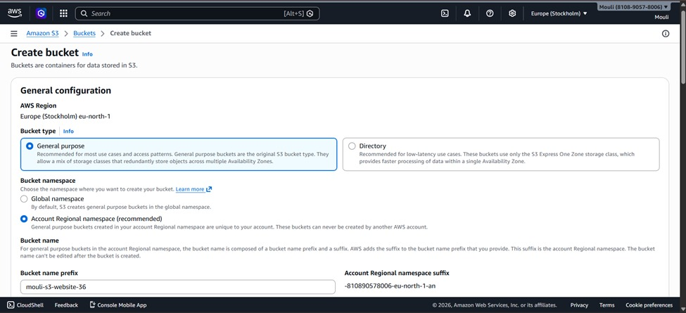
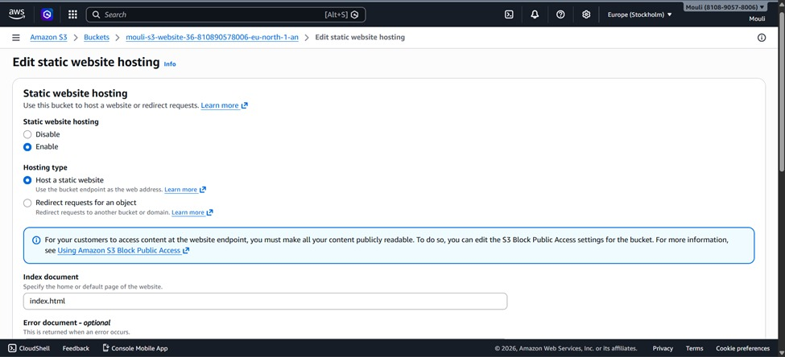
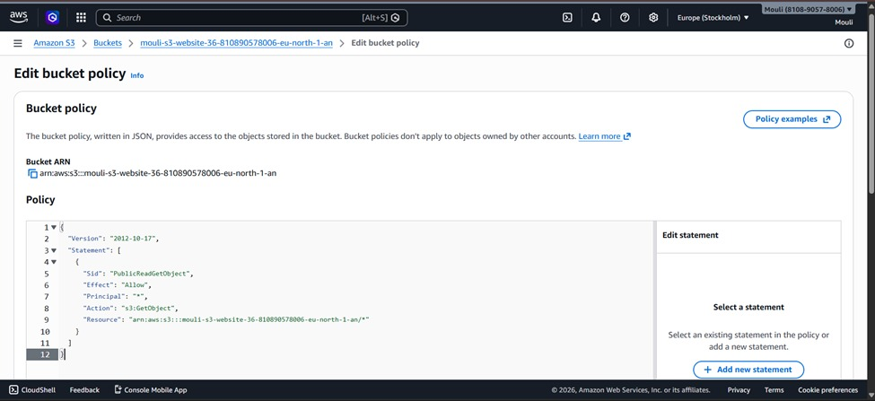
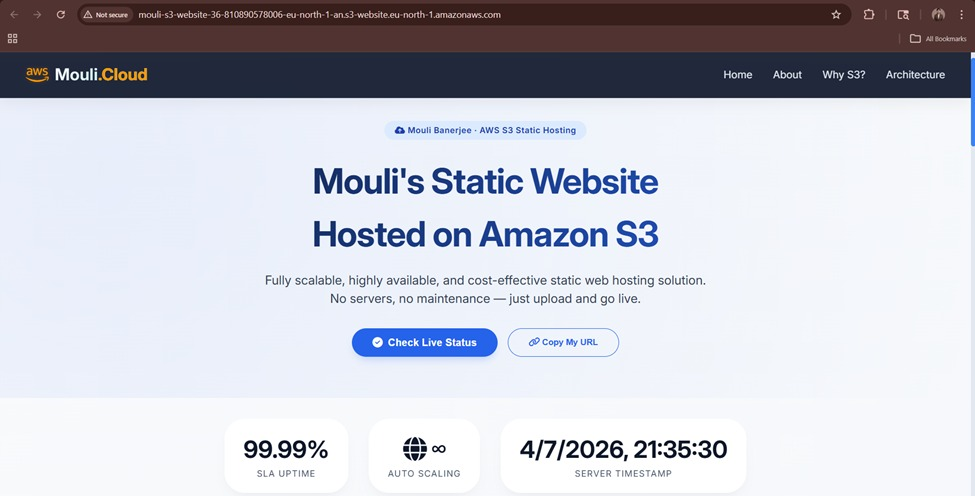

# 🌐 AWS S3 Static Website Hosting

## 📌 Project Overview
This project demonstrates how to host a **static website using Amazon S3**.  
The website is deployed using **serverless architecture**, ensuring high availability, scalability, and low cost.

---

## 🚀 Features
- ✔ Static website hosting using AWS S3  
- ✔ Highly scalable and reliable  
- ✔ Cost-efficient (pay only for usage)  
- ✔ Public access via bucket policy  
- ✔ Responsive UI using HTML, CSS, JavaScript  

---

## 🛠️ Technologies Used
- **HTML5**
- **CSS3**
- **JavaScript**
- **AWS S3**

---

## ⚙️ Deployment Steps

### 🔹 Step 1: Create S3 Bucket
```bash
Bucket Name: mouli-s3-website-36
Region: eu-north-1
Bucket Type: General Purpose
```

- Disabled **Block Public Access**
- Used default settings

---

### 🔹 Step 2: Upload Website Files
```bash
File Uploaded: index.html
```

- Uploaded main HTML file into S3 bucket

---

### 🔹 Step 3: Enable Static Website Hosting
```bash
Index Document: index.html
Hosting Type: Static Website Hosting Enabled
```

- Enabled static website hosting from **Properties tab**

---

### 🔹 Step 4: Configure Bucket Policy
```json
{
  "Version": "2012-10-17",
  "Statement": [
    {
      "Sid": "PublicReadGetObject",
      "Effect": "Allow",
      "Principal": "*",
      "Action": "s3:GetObject",
      "Resource": "arn:aws:s3:::mouli-s3-website-36-810890578006-eu-north-1-an/*"
    }
  ]
}
```

- Allowed public access using bucket policy

---

### 🔹 Step 5: Access Website
```bash
http://mouli-s3-website-36-810890578006-eu-north-1-an.s3-website-eu-north-1.amazonaws.com
```

- Website is publicly accessible via S3 endpoint

---

## 📸 Screenshots

### 📂 Bucket Created


### 📂 File Uploaded


### 🌐 Static Hosting Enabled


### 🔐 Bucket Policy


### 🚀 Final Output


---

## 📊 Output
The website is successfully hosted on AWS S3 and is publicly accessible via the generated endpoint.

---

## 📌 Conclusion
This project demonstrates how cloud platforms like AWS S3 can be used to deploy **fast, secure, and scalable static websites** without any backend infrastructure.
